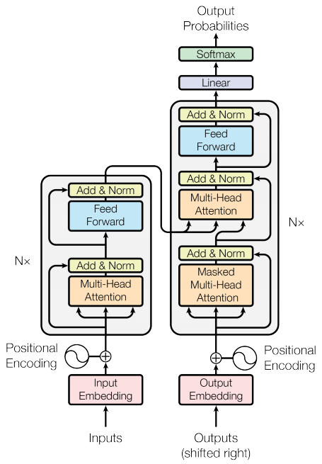
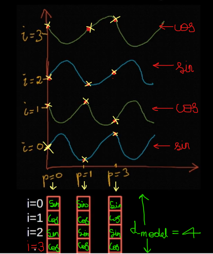
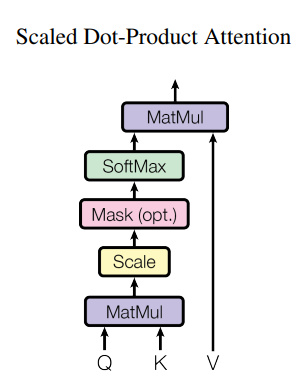

# Transformers: Attention Is All You Need

What do humans and artificial neural networks agree on?
That Attention Is All You Need ;)



## Introduction and Background
* RNNs were great but it was difficult to learn dependencies between distant positions in RNNs. In Transformers, this is reduced to a constant number of operations
* Self-attention, sometimes called intra-attention is an attention mechanism relating different positions of a single sequence in order to compute a representation of the sequence
* The Transformer is the first transduction model relying entirely on self-attention to compute representations of its input and output without using sequence-aligned RNNs or convolution

## Embedding
### Input Embedding
* What embeddings are:
  ```python
  EXAMPLE
  >>> # x (B, T) --embed--> x_embed (B, T, d_model)
  >>> # here T=5, d_model=2
  >>> x[0]
  tensor([25,  1, 14, 20,  8])

  >>> C = randn((27, 2)) # (vocab_size, d_model)
  >>> C[1] # 1 is embedded as the output, similarly for all characters
  tensor([-1.8336, -0.3422])                       # (27 chars in total)

  >>> C[x[0]] # (5, 2) # each integer is embedded as a 2-dimentional vector
  tensor([[ 0.3084, -0.4326], # <==25
          [-1.8336, -0.3422], # <==1
          [-0.0688,  1.9716], # <==14
          [-0.6746, -0.4913], # <==20
          [-2.6784, -0.2533]])# <==8
  ```
* Use Learnable Embeddings to convert input tokens and output tokens to vectors of dimension `d_model`

### Positional Embedding
* The model contains no recurrence and no convolution, for the model to make use of the order of the sequence, we must inject some information about the relative or absolute position of the embeddings
*
   ```python
      PE_(pos, i) = sin(pos/1e4**(i/d_model)) if i % 2 == 0 else cos(pos/1e4**(i-1/d_model))
   ```
* The authors chose this function because we hypothesized it would allow the model to easily learn to attend by relative positions, since for any fixed offset `k`, `PE_(pos+k)` can be represented as a linear function of
`PE_(pos)`
* They also experimented with using learned positional embeddings instead and found that the two versions produced nearly identical results. They chose the sinusoidal version because it may allow the model to extrapolate to sequence lengths longer than the ones encountered during training. However, you can also apply the normal embedding used in word embeddings for positional embeddings

* 


## Scalled-Dot-Product Attention
* 
* The key/value/query concept is analogous to retrieval systems. For example, when you search for videos on YouTube, the search engine will map your query (text in the search bar) against a set of keys (video title, description, etc.) associated with candidate videos in their database, then present you the best-matched videos (values).

* Retrieves a value `v_i` for a query `q` based on a key `k_i` in the database.

* The tensor `score` before masking, tells how much correlated each word is with other words in the sentence as shown above
  
  

* Now suppose we are doing machine translation from Kannada to English. When humans do it, first we read the entire sentence in Kannada and then start translating to English. Our model does it similarly
* **The Kannada sentence enters the encoder which is not masked (can see future tokens like how we read the entire sentence then translate)** and **the English sentence enters the decoder which is masked *(We don't want the decoder to cheat by seeing the future tokens through attention while training (while inference there) Eg: "am" shouldn't have access to the attention weight of "fine" as it is from the future. Similarly for others all other words)***
* How masking?

  
* So, we mask the future attention weights with `-inf`
  
  

* Then the softmax function makes them 0
  
  

* If we mask the illegal connections as `0` after softmax, the sum won't be `1`, so we mask the illegal connections as `-inf` before applying softmax, so after applying softmax the sum will be `1`

## Multi-Head Attention

* Instead of performing a single Attention function with Queries, Keys and Values, the authors found that it is beneficial to linearly transform the Queries, Key and Values `h` times with different learned linear projections as shown in the above figure. Then they are concatenated and linear transformed again.

* Multi-head attention allows the model to jointly attend to information from different representation subspaces at different positions. With a single attention head, averaging inhibits this.

`MultiHead(Q, K, V) = Concat(h_1, ..., h_h)`
  where `h_i = Scalled_Dot_Product_Attention(W_Q @ Q, W_K @ K, W_V @ V)`

## Feed-Forward Layers
* 2 Feed-Forward Layers, 1st with a relu activation and the 2nd without any activation
* The dimensionality of input and output is `d_model`, the inner-layer has dimensionality `d_model*4`

## The Model
### For Machine Translation
* Encoder: Each layer has 2 sub-layers. The first is a multi-head self-attention mechanism, and the second is a simple, position-wise fully connected feed-forward network. There are residual connections also.
The output of each SubLayer is `LayerNorm(x + Sublayer(x))`.

* Decoder: Has 3 sub-layers, unlike the Encoder. The first sublayer is modified to prevent positions from attending further positions. This masking, combined with the fact that the output embeddings are offset by one position, ensures that the predictions for position `i` can depend only on the known outputs at positions less than `i`.

* 

---

### For AutoRegressive Tasks

* **GPT-1 architecture**

  
---

### How is Attention applied?

* **Encoder-Decoder Attention (Cross-Attention):**
 * *Queries from previous Decoder*
 * *Keys and Values (both are the same) from the output of Encoder*
 * *This allows every position in the decoder to attend overall positions in the input sequence. This mimics the typical encoder-decoder RNN-attention-mechanisms in seq-to-seq models*

* **Self-Attention in Encoder:**
  * *Keys, Queries and Values come from the same place, in this case, the input or the previous layer of Encoder*

* **Self-Attention in Decoder:**
  * *We need to prevent the leftward flow of information i.e information from the future, otherwise it would be cheating as the model would see words that it should have to predict later (in the context of seq2seq-RNN model, we use Bidirectional RNN in Encoder, but not in Decoder so that it doesn't cheat, RNN is a sequential model so there's no need to mask, but transformer is not a sequential model so we need to mask the inputs)*

  * *We implement this inside Scaled-Dot-Product-Attention, by masking out
   (setting to `float("-inf")`) all values in the input of the softmax which correspond to illegal connections

---

### Regularization: Dropout

* Applied to the output of each sub-layer before it is added to the sub-layer input and normalized
* Applied to the embeddings in both the Encoder and Decoder
---

## Optimizer:

* Adam Optimizer with `β1=0.9`, `β2=0.98` and `epsilon=1e-9`
* Learning Rate Schedule:
  * `lr = (d_model**-0.5) * min(step**-0.5, step * warmup_steps**-1.5)`
  * This corresponds to increasing the learning rate linearly for the first warmup_steps training steps and decreasing it after that proportionally to the inverse square root of the step number.

# References
* [Paper: Attention Is All You Need](https://arxiv.org/pdf/1706.03762v5.pdf)
* [BLog: The Illustrated Transformer](https://jalammar.github.io/illustrated-transformer/)
* [Video: Let's build GPT: from scratch, in code, spelled out](https://www.youtube.com/watch?v=kCc8FmEb1nY)
